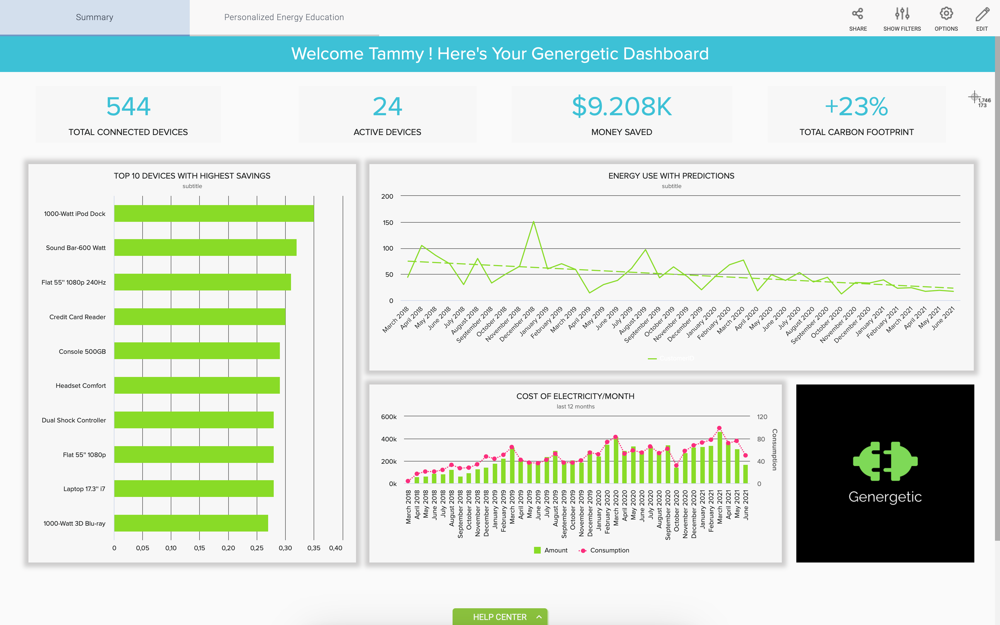
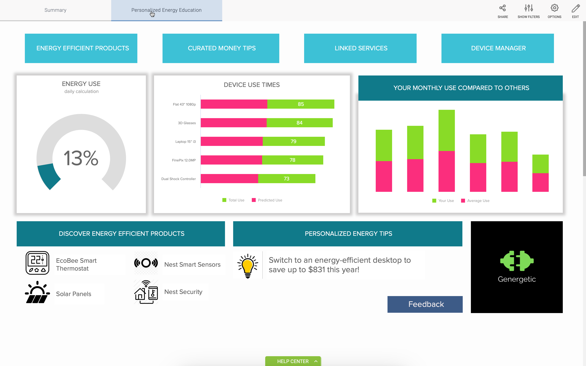

Dashboard

Future Dashboard

1. Summary Tab

### Description:
  
  * This is the dashboard home page. Upon successful login, users are presented with a personalized home page. 
  * On the top menu, users can glance at some of their stats like total connected devices, Active devices, how much money they have saved (Depending on their preferred filter). On the fr right, users can see the environmental impact their decisions have made.
  * Rght under the total connected devices, users can view their topmost energy-saving devices. 
  * On the right, users can view their energy every month along with a predicted trend line based on their past usage using machine learning and Cognos. 
  * Under the energy use with predictions, we have the cost of energy used by the user

2. 

 ### Discription: 
  
 * Under this section, we have four buttons, a button to discover energy-efficient products, tips on how a user can save money based on their activity and usage. Next to that is a button to view all the linked services users have activated on their accounts.
 * on the row below the buttons, users first see the percentage of how much energy they used today using machine learning to determine the user's usage pattern.
 * In the middle, users can view the device use time while being compared to an average person's usage for the same device. 
 * Right next to that chart, users can view their money usage compared to an average user. 
 * on the bottom row, users have the option to view a select few energy-efficient products based on their needs accompanied by some personalized tips that users could use to make maximize their profits 
